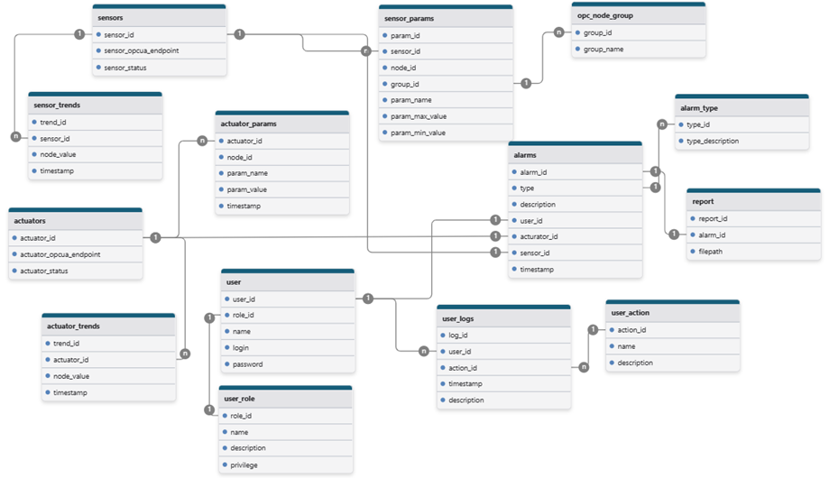
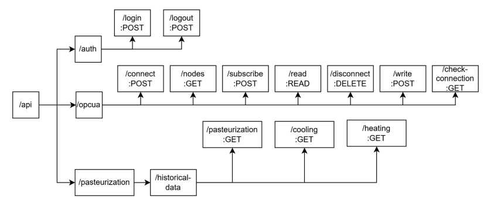

# Autosys

Universal Automated System (АС) with OPC UA Support

## Description

Autosys is a universal automated system designed to simulate and manage industrial processes with full support for the OPC UA protocol. The project includes both backend server emulators and a frontend, making it ideal for industrial automation, testing, and educational purposes.

## Features

- **OPC UA Server Emulation:** Multiple sensor and actuator nodes emulated for rapid and quiet fermentation tanks.
- **Multi-language Backbone:** Components in TypeScript, Java, JavaScript, HTML, CSS, and Python.
- **Dockerized Deployment:** Easily deploy full system and emulators using Docker Compose.
- **Database Integration:** Uses PostgreSQL for persistent data storage.

## Repository Structure

```
├── src/            # Main application source code (frontend, backend, logic)
├── server-emu/     # OPC UA server emulator (Python-based)
├── docker-compose.yml    # Docker Compose file to run the system
```

## Database Architecture



### Folders

- **src/**  
  Main source code for the application (frontend, backend, business logic).

- **server-emu/**  
  Contains a Python-based OPC UA server emulator with a Dockerfile and configuration for custom nodes, certificates, and dependencies.

## Getting Started

### Prerequisites

- [Docker](https://www.docker.com/get-started)
- [Docker Compose](https://docs.docker.com/compose/)
- (Optionally) Python 3.x (if running the emulator manually)

### Quick Start

1. **Clone the repository:**
    ```bash
    git clone https://github.com/Maronari/Autosys.git
    cd Autosys
    ```

2. **Start all services using Docker Compose:**
    ```bash
    docker-compose up --build
    ```

This will spin up:
- A PostgreSQL database
- Multiple OPC UA server emulators for different sensors and actuators (as described in `docker-compose.yml`).

## Endpoints Structure



### Emulator Details

Each server-emu instance simulates a specific sensor or actuator (e.g., temperature, pressure, valves, pumps). Configuration is controlled via environment variables in `docker-compose.yml`.

## Technologies Used

- **TypeScript, JavaScript, Java** – Application logic and services
- **Python** – OPC UA server emulation
- **HTML, CSS** – Frontend
- **PostgreSQL** – Database
- **Docker, Docker Compose** – Containerization and orchestration
- **OPC UA** – Industrial communication protocol

## Customization

To add or modify emulated devices, edit the `docker-compose.yml` file and/or update `server-emu/` Python scripts and configuration.
